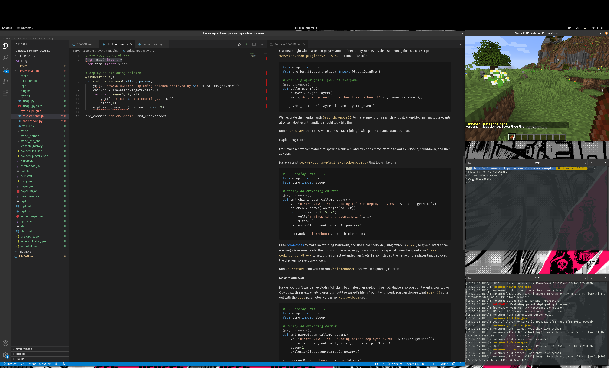

# minecraft python server example

This will walk you through setting up a minecraft server that can be extended with python & writing some plugins. It uses [minecraft-python](https://github.com/Macuyiko/minecraft-python) to make things more fun & easy than writing plugins directly in java.



## server

First, we need to setup a server:

* Install [java](https://www.java.com/ES/download/) on your system
* Install a text-editor. I like [VSCode](https://code.visualstudio.com/).
* Make a directory called `server/`
* Download [spigot](https://getbukkit.org/download/spigot) (choose latest version) and save it as `server/spigot.jar`
* Copy files in `server/` from this repo to your `server/` dir
* Download the latest [minecraft python.jar](https://github.com/Macuyiko/minecraft-python/releases) and put it in `server/plugins`
* Open a cmd-shell (windows) or terminal in `server/`. Run `./start` to start the server once, and edit eula.txt to accept it.
* Run `./start` again, and then `op` yourself in the minecraft-terminal, so you can run everything.

You will also need these to be able to use the REPL:

* Install [python 3.x](https://www.python.org/downloads/). On mac & linux you should already have this.
* Install [pip](https://pip.pypa.io/en/stable/installing/)
* Run `pip install websocket-client`


### tools

I wrote these as shell-scripts (for mac & linux) and bat files (for windows) so the commands should work in both places.

* `./start` - starts up the server
* `./repl` - lets you connect to python plugin and test things out, once the server is running


If you are using [VSCode](https://code.visualstudio.com/), you can open the built-in terminal (with `Ctrl-Backtick`), and run these directly.

### file-locations

* `server/python-plugins` - put your plugins here
* `server/python` - put your shared library files here, so you can share code between different plugins. Minecraft python makes a script called `mcapi.py`, which you should have a look at (see the stuff below `Built-in helper functions`) that gives you some utilities for your plugins, but you can add whatever you want in this dir, and use it in your plugins.

### reloading

You often have to reload the server in order to pickup your plugin. There is a command `/reload` that can do this, but it often complains about a port being in use. It's recommended to `/stop` it, then run it again.


## plugins

Your first stop for how to do things should be the [Bukkit API docs](https://hub.spigotmc.org/javadocs/bukkit/index.html). The python API mostly follows java-bukkit, but sometimes there are little things you have to do, to work around jython-binding complexity. You can see some examples of this, if you look at `server/python/mcapi.py`.

# yell-o world

Our first plugin will just tell all players about minecraft python, every time someone joins. Make a script `server/python-plugins/yell-o.py` that looks like this:

```python
from mcapi import *
from org.bukkit.event.player import PlayerJoinEvent

# when a player joins, yell at everyone
@asynchronous()
def yello_event(e):
  player = e.getPlayer()
  yell("%s just joined. Hope they like python!!!" % (player.getName()))

add_event_listener(PlayerJoinEvent, yello_event)
```

We add `@asynchronous()` before the function, to make sure it runs asynchronously (non-blocking, multiple events at once.) Most event-handlers should look like this.

Reload minecraft. After this, when a new player joins, it will spam everyone about python. 


## exploding chickens

Let's make a new command that spawns a chicken, and explodes it. We want it to warn everyone, countdown, and then explode.

Make a script `server/python-plugins/chickenboom.py` that looks like this: